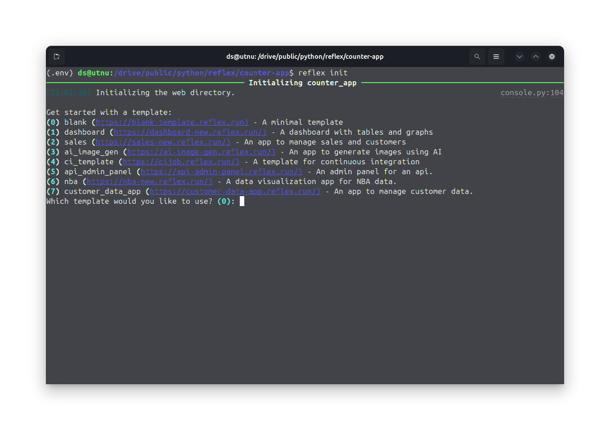
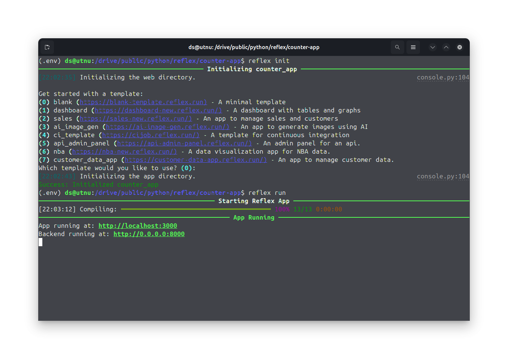
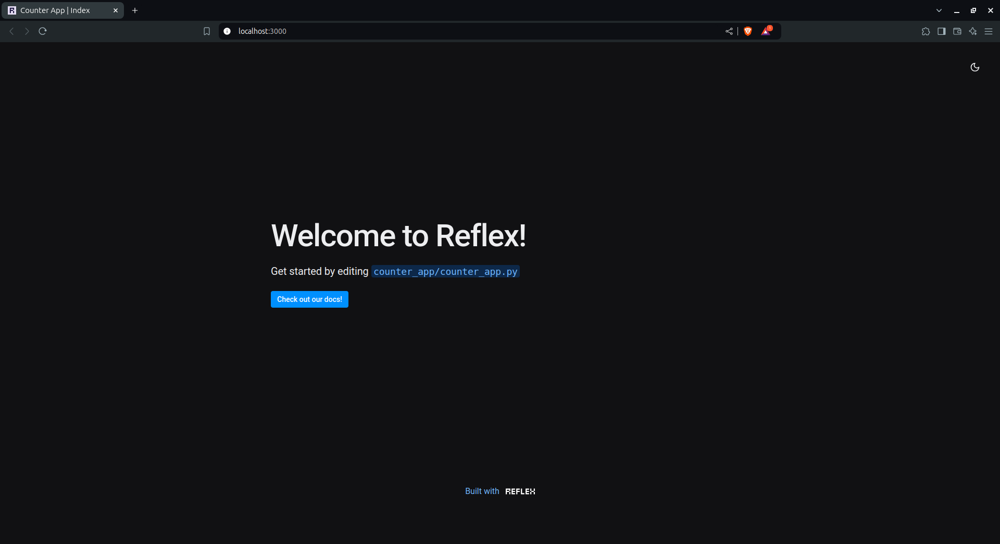
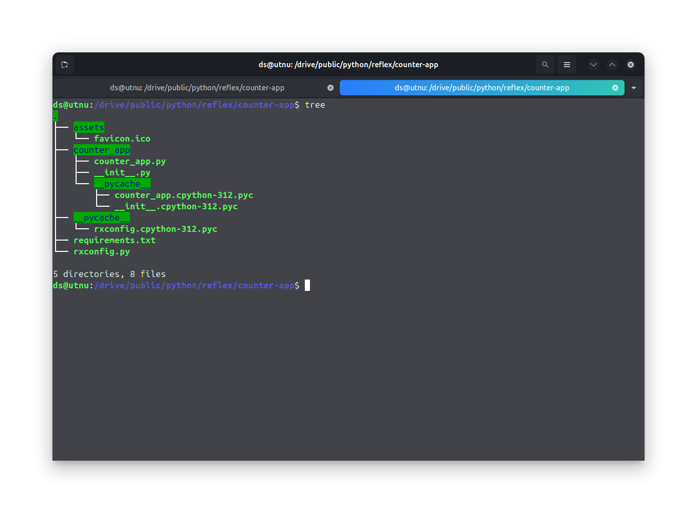
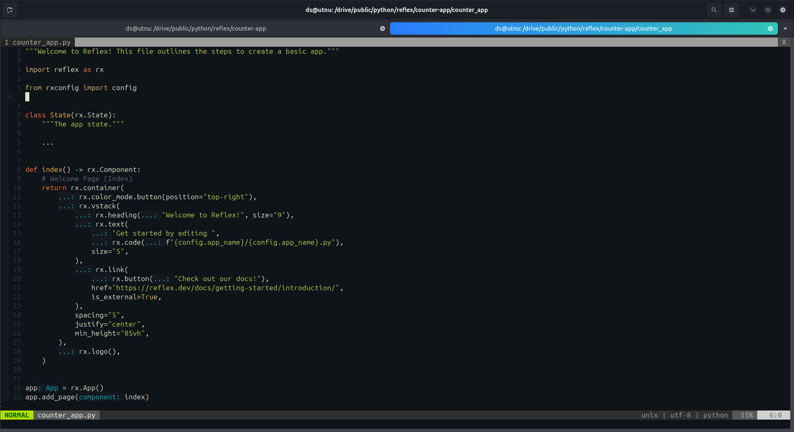

# Counter App

## Getting Started

### Setting up pyton environment
 
First, create a python virtual environment to keep the packages separately. (this is optional, you can download the packages globally).

```
python -m venv .env 
```

Now if you have created a virtual environment then activate it.

```
# for linux user
source .env/bin/activate

# for windows user
.env\Scripts\activate
```

Once all set, download the **Reflex** library. 
```
pip install reflex
```

### Initializing Reflex

Once the **Reflex** package is download, we can initialize a reflex project in our current directory using `reflex init` command in the terminal.
While initializing the project, it will ask to select a template.



Since we are making a simple counter app I am going with the default blank template.


Once the project is created you can enter `reflex run` command to run it. Then it reflex will serve your website at port 3000.



Now open `localhost:3000` in your web browser. You will be greeted with this demo if you also choose the blank template.




### Editing the code

Now open the project directory. And see the project structure. It will look something like this.



Inside of your project directory you will find another directory of same name. But for me its different because I have used a hyphen (-) in the project directory name. So it has change it to underscore ( _ ). Inside that directory there is a python file with the same name of the directory. That python file contains all teh python code for the website, to make any changes to the website we have to edit that file. 

Now open that python file in a text editor.



Let's edit this file to build our counter app.

